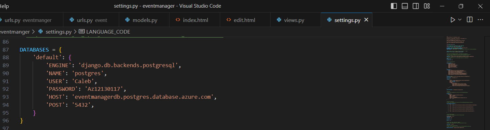

# IS-4990-eventmanager-project
My project is an event manager project that allows users to keep track of events they want to attend and will allow them to edit or delete any events they have created. I deployed a database for my app and created an Azure Active Directory B2C tenant to allow for users to login via a Microsoft account once integrated to an Azure web app.

### Azure diagram

### Project DFD

### The Services Used
I used a PostgreSQL database since the base database for django is a sqlite database which is not able to be imported to Azure. I also tried use the Azure Active Directory and a B2C tenant to allow for users to login to my app securely.

### How to make Azure Services
PostgreSQL database CLI command: az postgres flexible-server create --name eventmanagerdb --resource-group rg-carnahan --location eastus --tier Burstable --sku Standard_B1ms --login Caleb --password Az12130117 (Should ask for allowing the database server to use client's IP address to which answer yes. If not got to the database in the portal, click networking, and scroll down and click to allow client IP address). In order to utilize the database locally download the eventmanager files and if you want to change any aaspects of the database (i.e. password, login, name) just change the corresponding code in the settings.py file. After the settings are set successfully, to run the code open an IDE with python and django installed and run python manage.py runsever and copy and paste the development server url into a browser and the app will show up

For Azure B2C tenant: Click left menu, Click Active Directory and apply for Azure B2C tenant. After the tenant is created scroll to App registration and register the web app you want to use Dctive Directory for. 

### Adherence to the 5 pillars of the Azure Well Architected Framework
The 1 recommendation the advisor asked for wasn't for any of my created services

### Future Revisions
Figure out proper deployment to Azure App Service as database needs to be linked to web app. As well as integrating Azure Active Directory as I was unable to find the right files and commands to run AD locally without breaking my program.

### Errors
Azure App Service apparently can't handle sqlite database files which causes the web app to fail. This is important since django programs automatically uses sqlite files and I tried to use a postgresql database hosted in Azure but was unable to link the database to the web app. I also tried to integrate Azure Active Directory B2C and utilize it locally, but command that allows the files created for Active Directory refuses to download and can't work.
