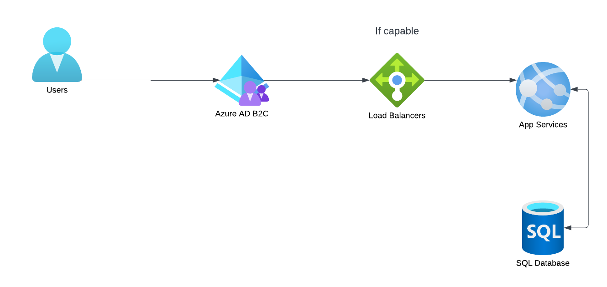

# IS-4990-eventmanager-project
My project is an event manager project that allows users to keep track of events they want to attend and will allow them to edit or delete any events they have created. I am working to deploy my project to Azure in app service and utilize Azure Active Directory to allow for users to login via a Microsoft account.

### Azure diagram

### Project DFD

### The Services Used
I used a PostgreSQL database since the base database for django is a sqlite database which is not able to be imported to Azure. I also use the Azure Active Directory and a B2C tenant to allow for users to login to my app securely.

### How to make Azure Services
PostgreSQL database CLI command: az postgres flexible-server create --name eventmanagerdb --resource-group rg-carnahan --location eastus --tier Burstable --sku Standard_B1ms --login Caleb --password Az12130117 (Should ask for allowing the database server to use client's IP address to which answer yes. If not got to the database in the portal, click networking, and scroll down and click to allow client IP address)

For Azure B2C tenant: Click left menu, Click Active Directory and apply for Azure B2C tenant:

### Adherence to the 5 pillars of the Azure Well Architected Framework
The 1 recommendation the advisor asked for wasn't for any of my created services

### Future Revisions
